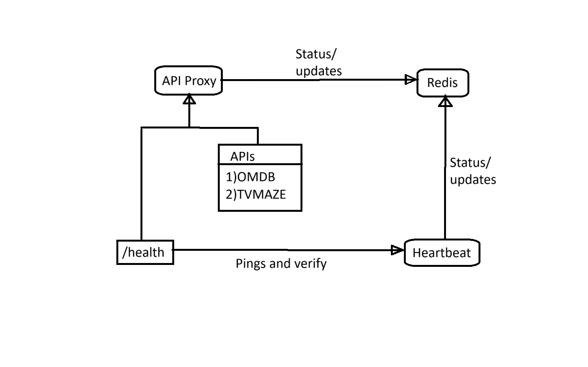

# Resilient API Proxy with Dockerized Services

## Overview

This project simulates a real-world scenario where a backend service interacts with 
multiple unreliable external APIs and must remain resilient under failures. 

This project handles:
● Resilient API handling (dockerized) (fallback logic, error classification, rate 
limiting) 
● Heartbeat monitoring (dockerized)  between containers 
● Real-time communication between Docker containers (e.g., WebSocket or 
message queue)

## Setup

### Prerequisites

- Docker & Docker Compose installed
- Optional: Node.js / Python (if needed for testing)


### Clone Repository

```bash
https://github.com/puneeth-9810/Bioquix-Assg.git
cd Bioquix-Assg
```

### Install Dependencies

- In each of the sub-folders install the dependencies needed.

```bash
npm install
```

### Run with Docker Compose

```bash
docker-compose up --build
```

---

##  Architecture

This project contains two microservices API Proxy and Heartbeat communicating via HTTP and Redis Pub/Sub inside a Docker network, demonstrating inter-container communication.

### API Proxy

-Handles client requests to /data?title=....
-Fetches movie/show data from:
 OMDB API
 TVMaze API
-Uses Circuit Breaker (Opossum) to handle API failures and retry logic.
-Publishes real-time status messages to Redis on the status channel.
-Responds to /health endpoint for liveness checks.

### Heartbeat

-Pings P1’s /health every 5 seconds to monitor availability.
-If P1 is healthy, publishes "API Proxy is healthy" to Redis.
-If P1 is down, publishes an error message.
-Can also subscribe to the Redis status channel to log or process status messages from P1.

### Redis

-Acts as a communication bridge between API Proxy and Heartbeat using Pub/Sub.
-Channel used: status*


